# 实验一 PyTorch基本操作实验

## 数据集介绍

1. 人工构造的数据集

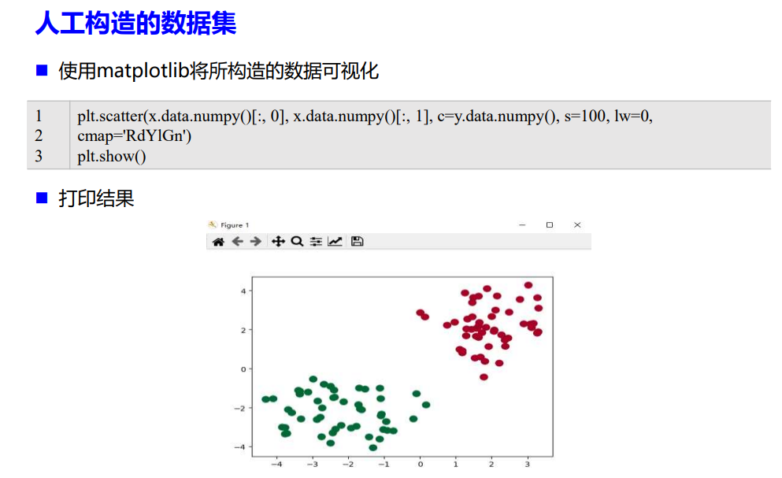

2. Fashion-MNIST数据集

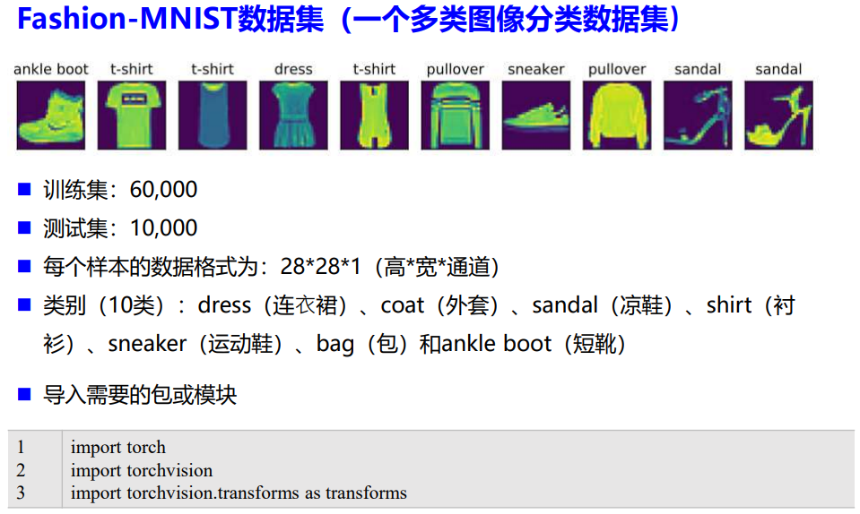

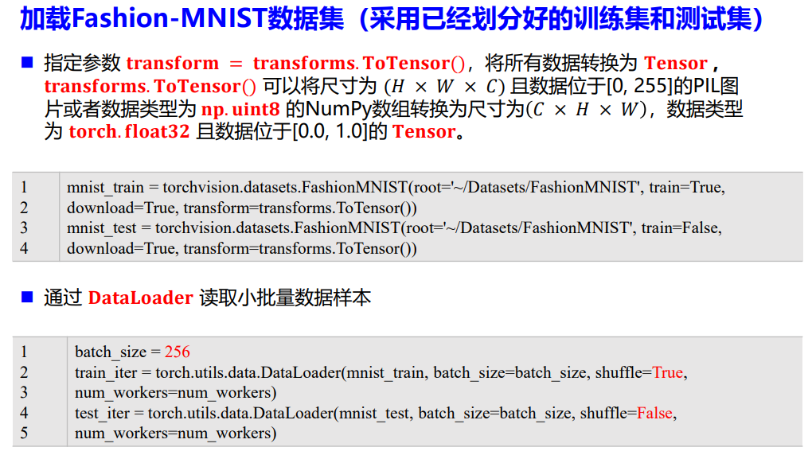

## 实验内容

### 1. PyTorch基本操作考察

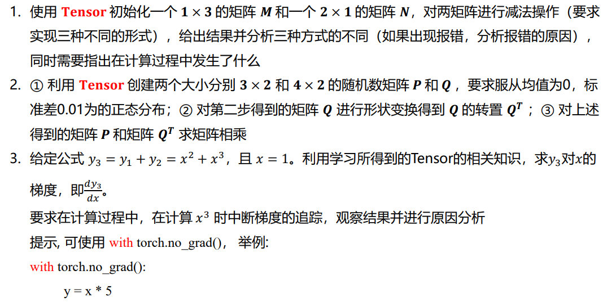

### 2. 动手实现Logistic回归

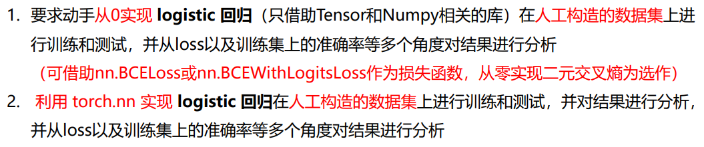

### 3. 手动实现softmax回归

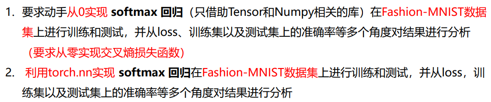

# 实验二 前馈神经网络实验

## 数据集介绍

1. 手动生成回归任务数据集

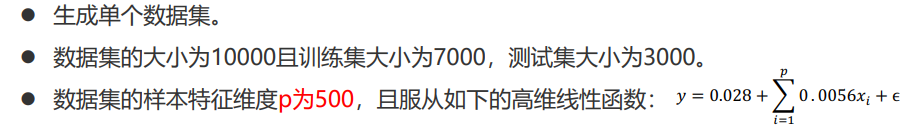

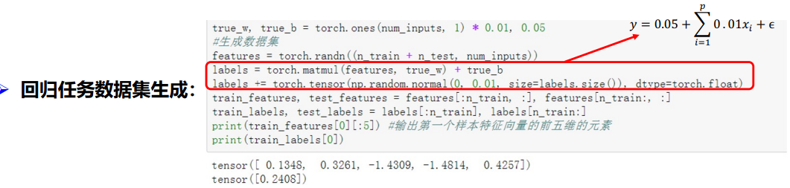

2. 手动生成二分类数据集

3. MNIST手写体数据集

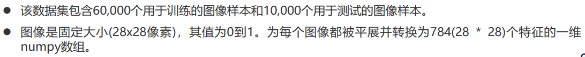

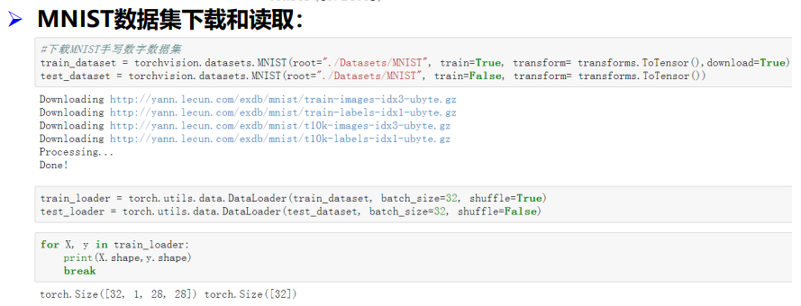

## 实验内容

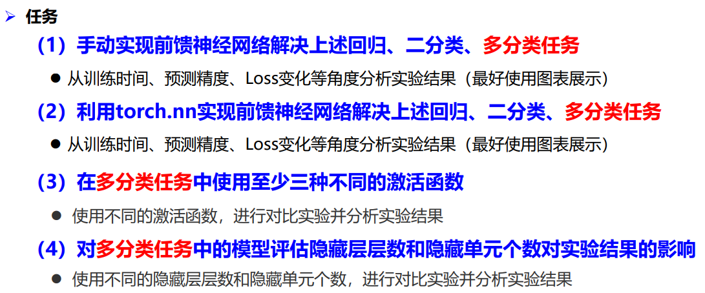

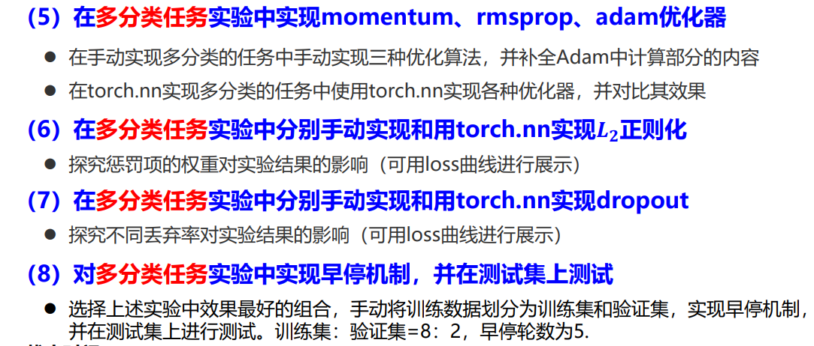

# 实验三 卷积神经网络实验

## 数据集介绍

### 1. 车辆分类数据集（分类任务）

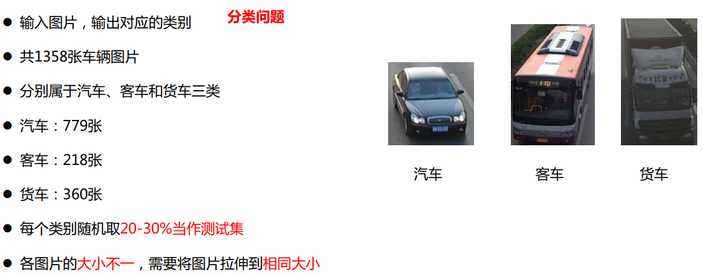

### 2. 图片去雾数据集

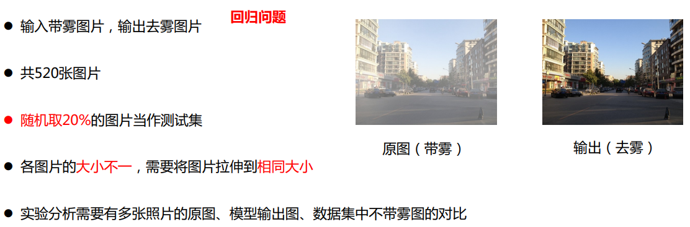

## 实验内容

### 1. 二维卷积实验

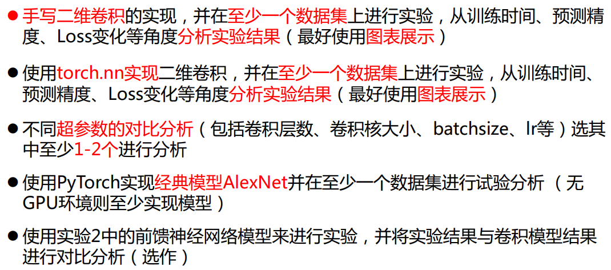

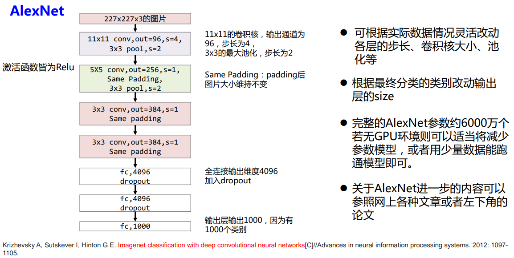

### 2. 空洞卷积实验

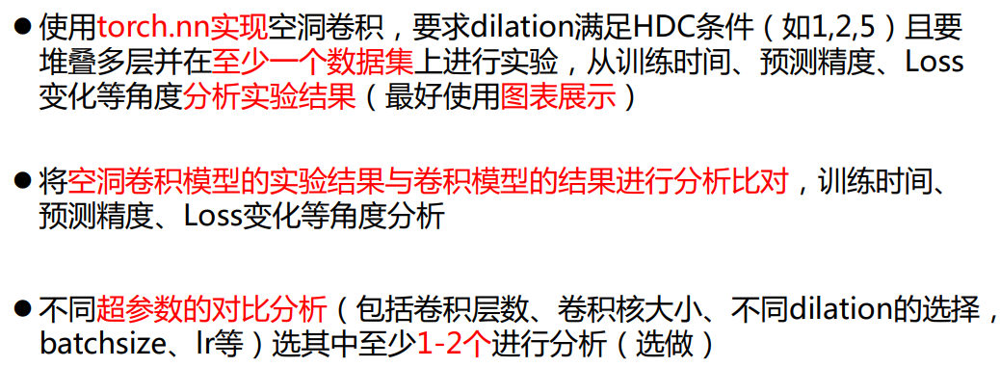

### 3. 残差网络实验

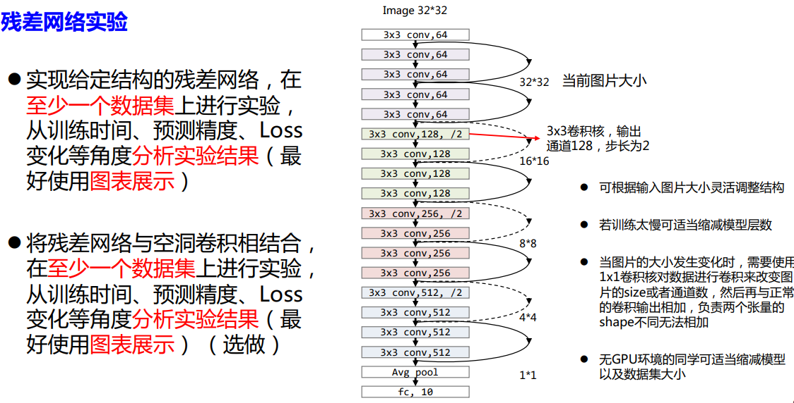

# 实验四 循环神经网络实验

## 数据集介绍

### 1. 高速公路车流量数据

> （回归任务：用历史流量数据预测未来流量）

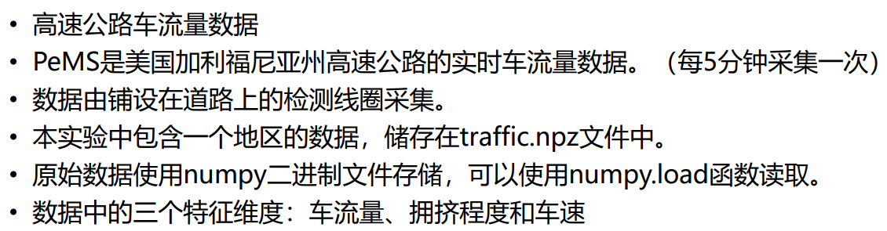

### 2. 用户签到数据

> （分类任务：用历史轨迹数据预测下一个签到点）

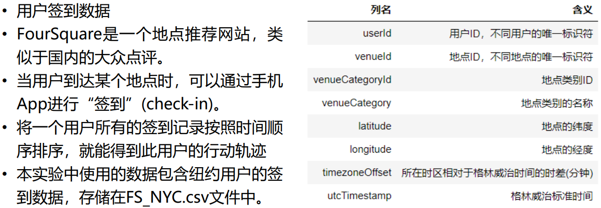

## 实验内容

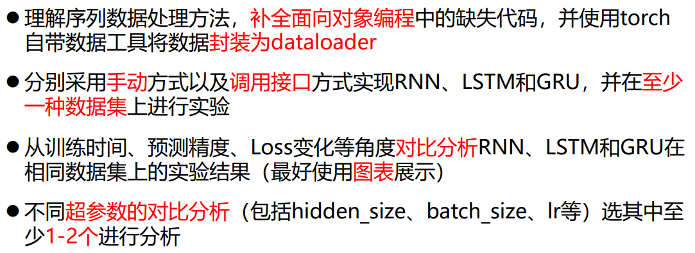

